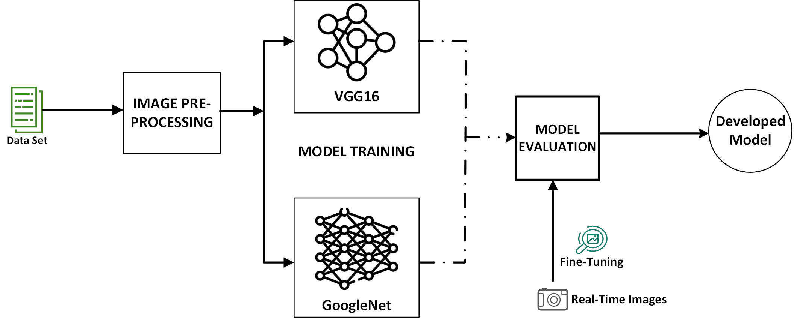
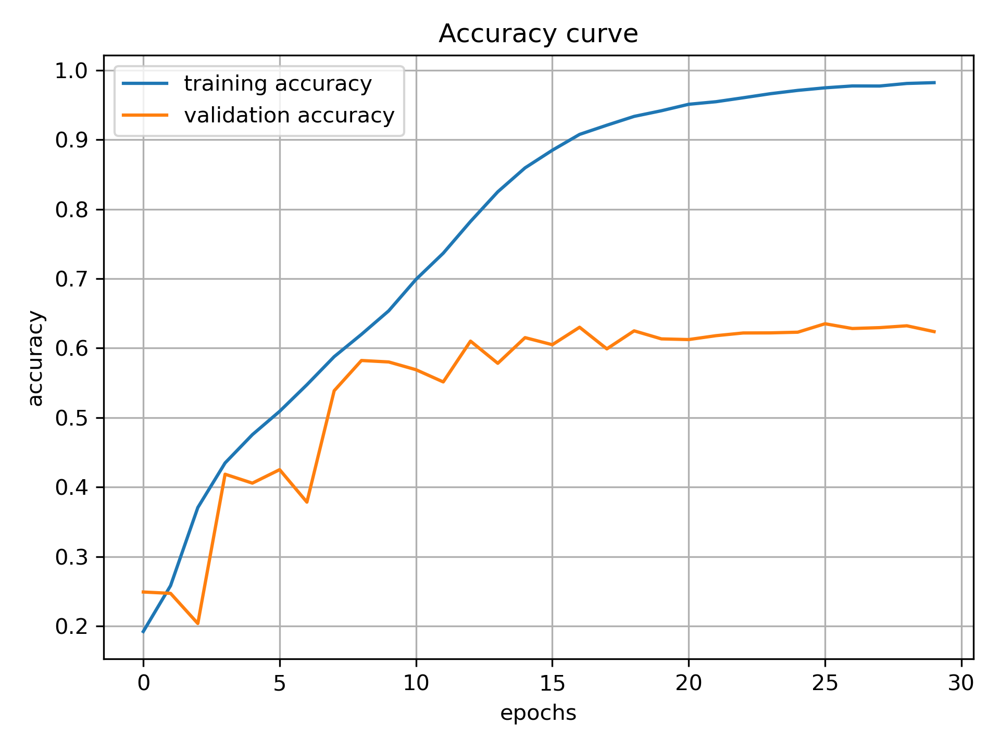
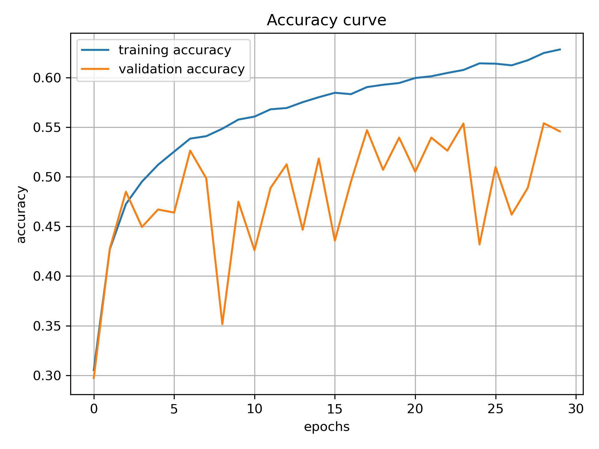

# Deep Learning approach to Facial Emotion Detection using Transfer Learning

### Motivation
As fascinating as computer systems are, they lack emotional states and thus cannot communicate their state facially, which humans can. Emotion is a mental state connected to the nervous system(Gaddam et al., 2022). It plays a significant role in human lives as it communicates peoples’ perception, pleasure, displeasure, and sense of judgement, which are fundamental to social impact. While humans can seldom hide their emotions, their knowledge of it remains highly resourceful for humanity’s betterment. For instance, through the knowledge of patients’ emotions, psychologists can understand their pressing challenges towards healing them. 

### Dataset Description
**The dataset consists of two folders labelled as train and test, containing 28,709 and 7178 images respectively. As shown in the four mages in Figure 3.2, each image is 48 by 48-pixel greyscale showing the emotion of the human. The two sets are labelled based on seven (7) kinds of emotion (angry:0, disgusted:1, fearful:2, happy:3, sad:5, surprised:6).**

### Adopted Methodology

### Result

**In this research, the novel method of deep learning (transfer learning) which maintains the balance between accuracy and processing time was adopted to recognize humans’ emotions from their images. The two models adopted (GoogLeNet and VGG16) showed a reckonable result, with the VGG16 outshining, attaining a training accuracy of 98% while the GoogLeNet lags with an accuracy of 63%, which was also validated by testing the models on randomly download images of humans from the internet. The result showed a significant result to reckon with, however, a subtle overfitting was recorded in both models which it is believed to have results from the biasness in the data distribution across the considered seven (7) emotions.**

#### VGG16

#### GoogLeNET

